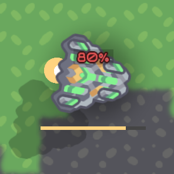
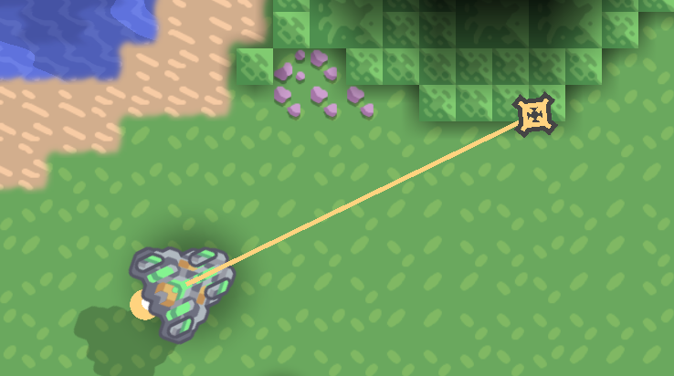
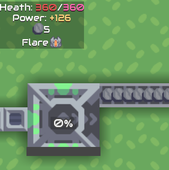
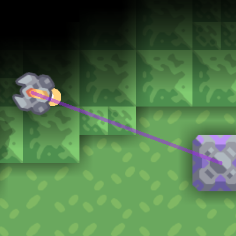

# Caster UI 

- A Mindustry Java mod that aims to make the client a bit better for casting!
- Java Rewite of [JiroCab/Caster-Ui](https://github.com/JiroCab/Caster-Ui) That was based on ['Ferlern/extended-UI'](https://github.com/ferlern/extended-ui-v7) **use said mods at the same with caution as it may break in a inglorious fashion**

# v8?
whem ot fully comes out

# Features
Everything can be Toggles on or off From "Setting > Caster Ui Setting"
And any hotkey can be rebinded!
Now mobile and foo's compatible (hopefully)

### - Player Trackers
- **Display where a player's cursor is**. Line, cursor & name are customizable
- Click on a players name in the Counters' mini player table to spectate them
- Use `;` & `'` cycle between players
- Hold `H` to Track their cursor instead, can be changed to a toggle
- Press  `home` to open a dialog to select a player & press a number to quickly spectate them

~~just refer to in game settings on how they look like since im too lazy to make an img for it~~

### - Player & Unit Counters
- **Displays all units per team** sorted base on the Core database order, Size of the table can be changed (On by default)
- Displays all players on the server, Payers without units will be hidden (On by default)
- A total can be added per teams
- Separating per team can be toggled for better readability or compactness (On by default)
- Counts can be changed to be beside or on top of a units icon (Beside by default)
- Customizable global and on command hide-list!

this is an absurd example but you get the point xp

### - Core Lost notifications
- Draw Circle on a core's death (On by default, speed & style can be changed)
- Get a Toast on a core's death (On by default, can be moved to the bottom of the screen)
- Send a message in chat on a Core death (Off by default)
- You Press `G` to snap your camera to the last core death

### - Unit Info
- Adds a Hp & shield bar to units (Style and text can be customized, make tank fps with more unit count)

- Show What a unit's current command is (customizable)

### - Block Info
- Hover on a block to get information such as power, items, liquids & etc.
- Show health of hovered blocks - for no reason other than be a less cool version of [deltanedas/waisa](https://github.com/deltanedas/waisa)
- Render Factories' progress (bars can be customized)
  
- Hover on a Factory to see its rally point (affected by `Show Block info`)
- Displays logic block's controlled units

# Building The Mod
It's the same with any other mod.

All you need to know is '`gradlew jar`, `gradlew deploy`
And `runMindustryClient `, `runMindustryServer ` to test it with [Toxopid](https://github.com/Xpdustry/Toxopid)

# Special thanks
- [Capitaine Echo](https://www.twitch.tv/capitaine_echo) - For Play testing the mod
- [Wizer/Ferlern](https://github.com/Ferlern) - for the orginal [Extended-ui mod](https://github.com/Ferlern/extended-UI-v7) which what the original Caster User-Interface is based on
- [xzxADIxzx](https://github.com/xzxADIxzx) - for [Scheme-Size](https://github.com/xzxADIxzx/Scheme-Size) as some features & code are base on / from it
- [guiYMOUR](https://github.com/guiYMOUR) - code for the mouse override is from [Extra Utilities](https://github.com/guiYMOUR/mindustry-Extra-Utilities-mod)
